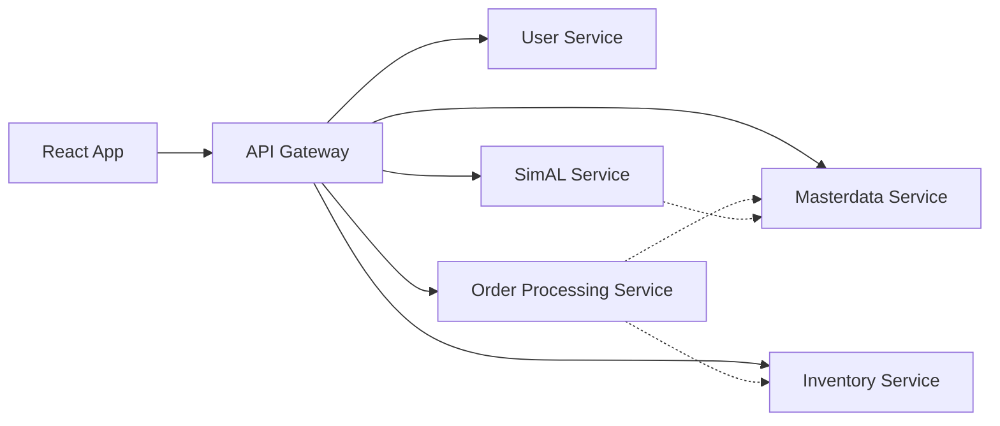
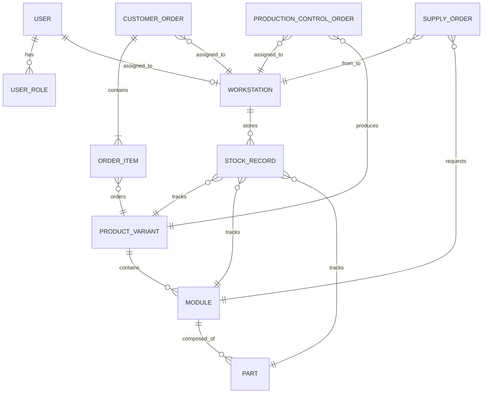
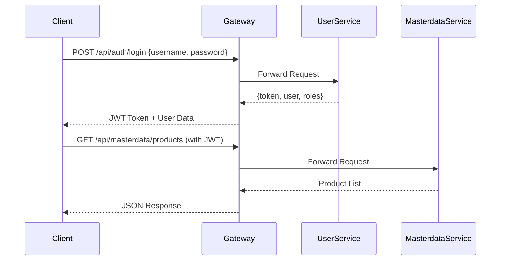

# Architecture & API Design

## System Architecture

### High-Level Architecture Diagram

```mermaid
flowchart TB
    Browser[Browser/React App]
    NginxProxy[Nginx Root Proxy]
    Frontend[Frontend (Nginx/React)]
    Gateway[API Gateway]
    UserService[User Service]
    MasterService[Masterdata Service]
    InventoryService[Inventory Service]
    OrderService[Order Processing Service]
    SimalService[SimAL Integration]
    UserDB[(User DB)]
    MasterDB[(Masterdata DB)]
    InventoryDB[(Inventory DB)]
    OrderDB[(Order DB)]
    SimalDB[(SimAL DB)]
    Browser --> NginxProxy --> Frontend --> Gateway
    Gateway --> UserService --> UserDB
    Gateway --> MasterService --> MasterDB
    Gateway --> InventoryService --> InventoryDB
    Gateway --> OrderService --> OrderDB
    Gateway --> SimalService --> SimalDB
```

### Microservice Communication



### Data Model Overview



---

## API Gateway & Endpoints

- All client requests flow through the **Spring Cloud Gateway** on port 8011.
- JWT validation, CORS, and centralized logging are handled at the gateway.

### API Base URLs
- Production: `http://localhost/api`
- Development: `http://localhost:8011/api`

### Authentication Flow



### Core API Endpoints

#### Authentication (`/api/auth`)
- `POST /api/auth/login` – User login, returns JWT token
- `POST /api/auth/refresh` – Refresh expired token

#### User Management (`/api/users`)
- `GET /api/users` – List all users (ADMIN)
- `POST /api/users` – Create new user (ADMIN)
- `PUT /api/users/{id}` – Update user (ADMIN)
- `DELETE /api/users/{id}` – Delete user (ADMIN)
- `GET /api/users/{id}` – Get user details (ADMIN)

#### Master Data (`/api/masterdata`)
- `GET /api/masterdata/product-variants` – List all products
- `POST /api/masterdata/product-variants` – Create product (ADMIN)
- `PUT /api/masterdata/product-variants/{id}` – Update product (ADMIN)
- `DELETE /api/masterdata/product-variants/{id}` – Delete product (ADMIN)
- `GET /api/masterdata/modules` – List all modules
- `GET /api/masterdata/parts` – List all parts
- `GET /api/masterdata/workstations` – List all workstations

#### Inventory Management (`/api/stock`)
- `GET /api/stock/workstation/{id}` – Get workstation inventory
- `GET /api/stock/alerts` – Get low stock alerts
- `PUT /api/stock/{id}` – Update stock quantity
- `POST /api/stock/transfer` – Transfer stock between workstations

#### Order Processing (`/api/customer-orders`, `/api/production-control-orders`)
- `GET /api/customer-orders/workstation/{id}` – List orders for workstation
- `POST /api/customer-orders` – Create customer order
- `PUT /api/customer-orders/{id}/fulfill` – Fulfill order
- `GET /api/production-control-orders` – List production orders
- `POST /api/production-control-orders/{id}/start` – Start production
- `POST /api/production-control-orders/{id}/complete` – Complete production
- `PATCH /api/production-control-orders/{id}/notes` – Update order notes

#### Supply Orders (`/api/supply-orders`)
- `GET /api/supply-orders/warehouse` – List all warehouse orders
- `POST /api/supply-orders` – Create supply order
- `PUT /api/supply-orders/{id}/fulfill` – Fulfill supply order
- `PUT /api/supply-orders/{id}/reject` – Reject supply order

#### Production Scheduling (`/api/simal`)
- `GET /api/simal/schedules` – List production schedules
- `POST /api/simal/schedules` – Create schedule
- `PUT /api/simal/schedules/{id}` – Update schedule

---

## Error Handling

All API errors return a standardized JSON structure with timestamp, status, error, message, and path.

---

For configuration, development, and troubleshooting, see the [Development & Operations Guide](README.devops.md).