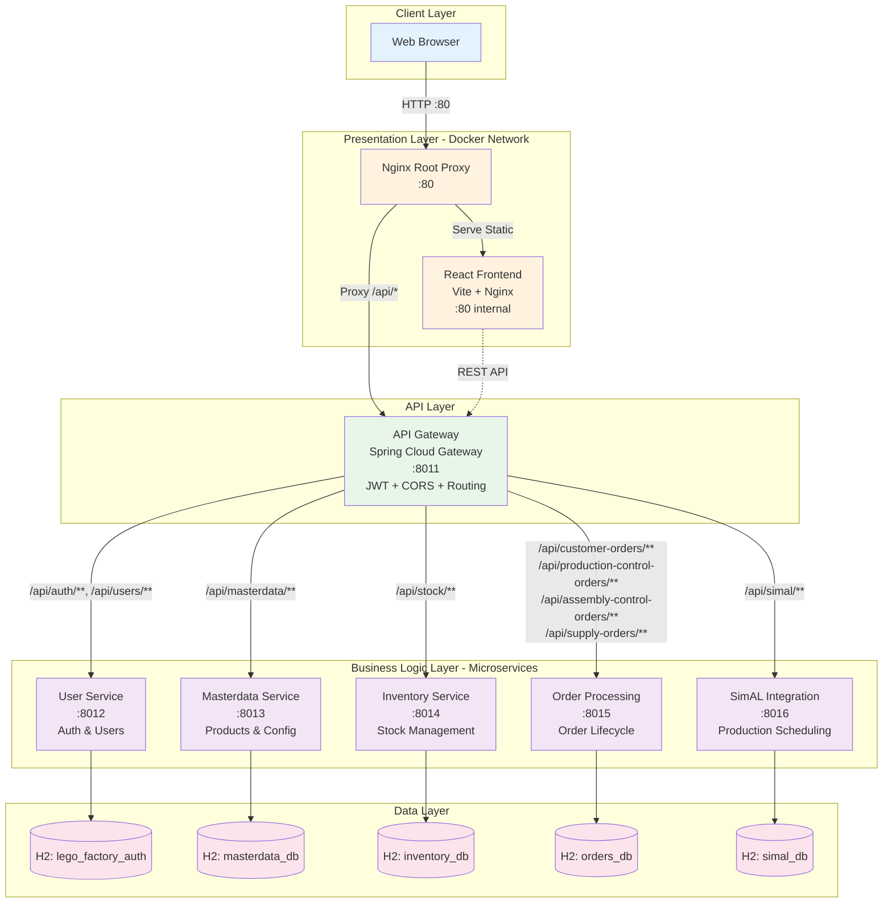
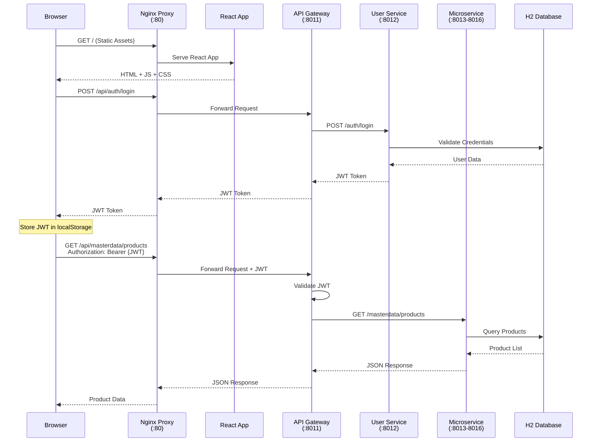
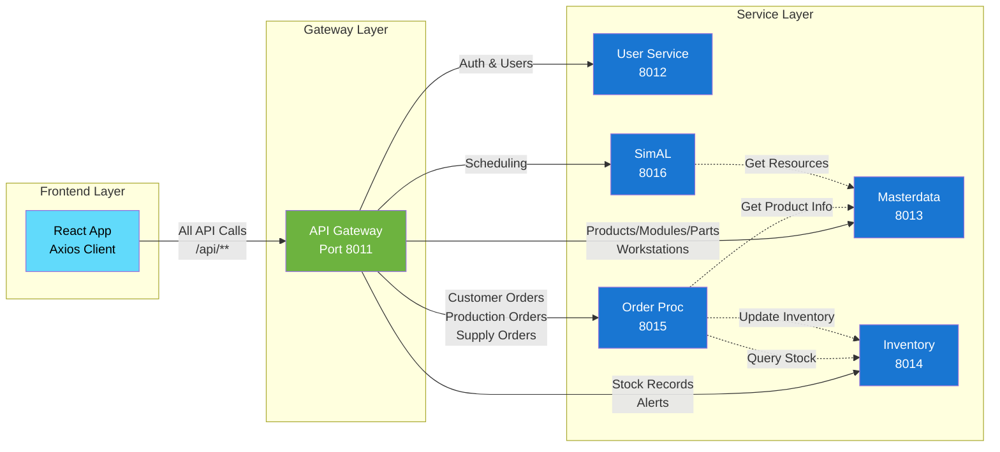
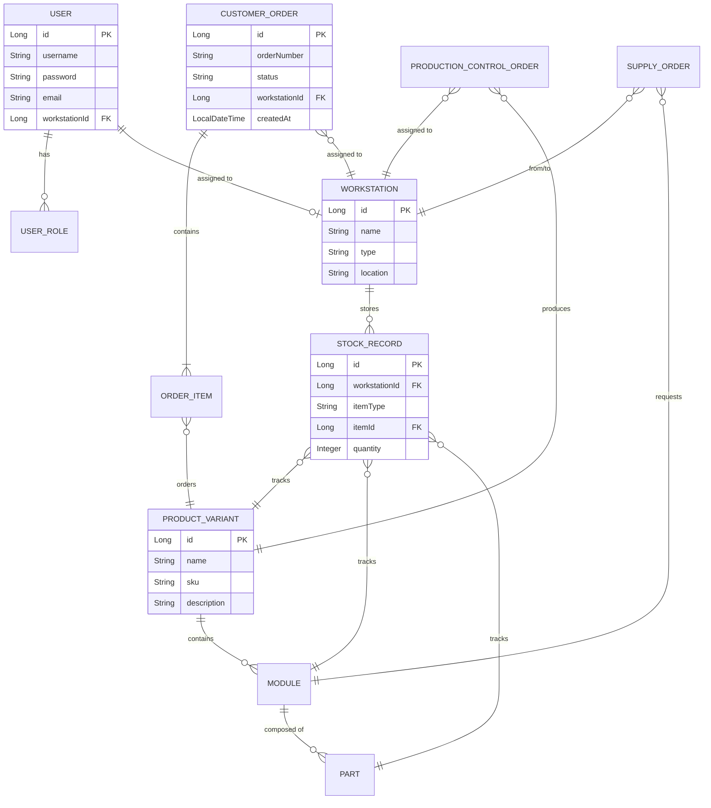
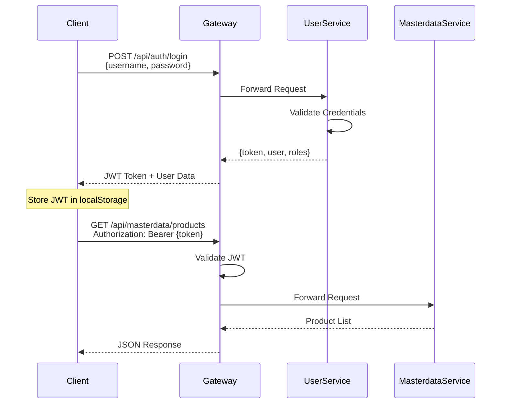

# 🏭 LEGO Sample Factory Control System

<div align="center">

[](LICENSE)
[](docker-compose.yml)
[](https://spring.io/projects/spring-boot)
[](https://reactjs.org/)
[]()

**LIFE** - LEGO Integrated Factory Execution

*A modern, microservice-based manufacturing control platform that digitizes and automates supply chain operations for the LEGO Sample Factory.*

[Quick Start](#-quick-start) • [Features](#-current-features) • [Architecture](#-system-architecture) • [API Documentation](#-api-design) • [Roadmap](#-roadmap)

</div>

---

## 📋 Table of Contents

- [Overview](#-overview)
- [Current Features](#-current-features)
- [System Architecture](#-system-architecture)
- [Technology Stack](#-technology-stack)
- [Quick Start](#-quick-start)
- [API Design](#-api-design)
- [Configuration](#-configuration)
- [Development](#-development)
- [Roadmap](#-roadmap)
- [Troubleshooting](#-troubleshooting)
- [Contributing](#-contributing)
- [License](#-license)

---

## 🎯 Overview

**LIFE** (LEGO Integrated Factory Execution) is a production-ready prototype that modernizes manufacturing operations through intelligent digital workflows. The platform provides:


- ✅ **Real-time Production Control** – End-to-end order lifecycle management from creation to fulfillment
- 🔐 **Role-Based Access Control** – Nine distinct roles with granular permissions (Admin, Plant Warehouse, Production Control, etc.)
- 📊 **Live Inventory Tracking** – Real-time stock monitoring across all workstations with automatic updates
- 🎯 **Workstation Assignment** – Dynamic task allocation based on user roles and workstation capabilities
- 📱 **Responsive Dashboards** – Role-specific interfaces optimized for operational efficiency
- 🔄 **Automated Workflows** – Intelligent order routing and status transitions based on business rules
- 🌐 **Microservice Architecture** – Independently scalable services with complete data isolation

### Key Benefits

- **Operational Efficiency**: Reduce manual paperwork and streamline production workflows
- **Real-Time Visibility**: Live dashboards provide instant insight into factory operations
- **Scalability**: Microservice design allows independent scaling of critical components
- **Flexibility**: Modular architecture supports rapid feature development and customization
- **Reliability**: Health checks, error handling, and comprehensive logging ensure system stability

---

## ✨ Current Features

### 🔐 Authentication & Authorization

- **JWT-Based Authentication** with secure token management
- **Nine Role Types**: 
  - `ADMIN` – System administration and user management
  - `PLANT_WAREHOUSE` – Customer order management and fulfillment
  - `MODULES_SUPERMARKET` – Module warehouse operations
  - `PRODUCTION_PLANNING` – Factory-wide production scheduling
  - `PRODUCTION_CONTROL` – Manufacturing order execution
  - `ASSEMBLY_CONTROL` – Assembly workstation operations
  - `PARTS_SUPPLY` – Parts warehouse management
  - `MANUFACTURING` – Production line operations
  - `VIEWER` – Read-only system access
- **Workstation-Based Access Control** – Users assigned to specific workstations for targeted operations
- **Protected Routes** with automatic token refresh and expiration handling

### 📦 Product & Inventory Management

- **Master Data Management**:
  - Product variants with configurable attributes
  - Module catalog with bill-of-materials
  - Parts library with specifications
  - Workstation registry (warehouses, manufacturing cells, assembly stations)
- **Real-Time Inventory**:
  - Live stock tracking per workstation
  - Automated inventory updates on order fulfillment
  - Low stock alerts and notifications
  - Multi-location inventory visibility

### 📋 Order Processing & Fulfillment

- **Customer Order Lifecycle**:
  - Order creation with multiple line items
  - Status tracking: `PENDING` → `IN_PROGRESS` → `COMPLETED` → `DELIVERED`
  - Workstation-specific order queues
  - Fulfillment actions with inventory validation
- **Production Control Orders**:
  - Manufacturing order creation and scheduling
  - Work-in-progress tracking
  - Start/pause/complete workflows
  - Notes and annotations for quality control
- **Warehouse Supply Orders**:
  - Cross-warehouse material requests
  - Approval workflows
  - Fulfillment tracking with quantity verification

### 🏭 Workstation Operations

- **Role-Specific Dashboards**:
  - **Admin Dashboard**: System KPIs, user management, configuration
  - **Plant Warehouse**: Customer order intake and fulfillment
  - **Modules Supermarket**: Internal warehouse request handling
  - **Production Planning**: Factory-wide scheduling and resource allocation
  - **Production Control**: Manufacturing task execution
  - **Assembly Control**: Assembly operation management
- **Task Management**: Work queues, priority sorting, deadline tracking
- **Live Updates**: Auto-refresh (5-10s intervals) for real-time data synchronization

### 📊 Production Scheduling (SimAL Integration)

- **Scheduling Engine**: Integration with SimAL for production planning
- **Resource Allocation**: Workstation and material availability checks
- **Production Control Order Generation**: Automated order creation from schedules
- **Assembly Control Order Management**: Sub-assembly tracking and coordination

### 🛡️ Error Handling & Observability

- **Comprehensive Logging**: Structured logs across all microservices
- **Health Checks**: Spring Boot Actuator endpoints for service monitoring
- **Global Exception Handling**: Standardized error responses with meaningful messages
- **API Gateway Monitoring**: Request/response logging and metrics

### 🎨 UI/UX Features

- **Responsive Design**: Optimized for desktop and tablet devices
- **Statistics Cards**: Visual KPI displays with color-coded indicators
- **Standard Table Styling**: Consistent data grid presentation with sorting
- **Notification System**: Toast messages for success/error feedback
- **Minimal Spacing**: Compact layouts maximizing screen real estate
- **Color-Coded Status Badges**: Instant visual status recognition

---

## 🏗️ System Architecture

### High-Level Architecture Diagram



### Request Flow Architecture



### Microservice Communication



### Data Model Overview



---

## 🛠️ Technology Stack

### Frontend
- **React 18** – Modern UI library with hooks
- **Vite** – Lightning-fast build tool and dev server
- **React Router v6** – Client-side routing with protected routes
- **Axios** – HTTP client with interceptors for JWT management
- **CSS Modules** – Scoped styling with standardized design system
- **Nginx** – Production web server for static assets

### Backend
- **Spring Boot 3.2** – Enterprise-grade Java framework
- **Spring Cloud Gateway** – API gateway with routing, filtering, and load balancing
- **Spring Security** – JWT authentication and role-based authorization
- **Spring Data JPA** – ORM with repository pattern
- **H2 Database** – Embedded in-memory database (development)
- **Maven** – Dependency management and build automation
- **Lombok** – Boilerplate code reduction

### DevOps & Infrastructure
- **Docker** – Containerization for all services
- **Docker Compose** – Multi-container orchestration
- **Nginx** – Reverse proxy and load balancer
- **Spring Boot Actuator** – Health checks and metrics

### Development Tools
- **VS Code** – Recommended IDE
- **Git** – Version control
- **PowerShell** – Automation scripts (Windows)

---

## 🚀 Quick Start

### Prerequisites

- **Docker Desktop** (Windows) - [Download](https://www.docker.com/products/docker-desktop)
- **Git** - [Download](https://git-scm.com/downloads)
- Minimum **8GB RAM** recommended
- **Port 80** available on host machine

### Installation Steps

1. **Clone the Repository**
   ```powershell
   git clone https://github.com/<your-org>/lego-sample-factory.git
   cd lego-sample-factory
   ```

2. **Configure Environment**
   ```powershell
   # Copy the example environment file
   Copy-Item .env.example .env
   
   # Edit .env and set your JWT secret (minimum 32 characters)
   # SECURITY_JWT_SECRET=your-secure-secret-key-here-min-32-chars
   ```

3. **Start the Application**
   ```powershell
   # Option 1: Using PowerShell script (Windows)
   .\start-factory.ps1
   
   # Option 2: Using Docker Compose directly
   docker-compose up --build -d
   ```

4. **Verify Services**
   ```powershell
   # Check all containers are running
   docker-compose ps
   
   # View logs
   docker-compose logs -f
   ```

5. **Access the Application**
   - **Frontend**: http://localhost
   - **API Gateway**: http://localhost:8011/actuator/health
   - **Gateway Routes**: http://localhost:8011/actuator/gateway/routes

### Default Test Accounts

| Username | Password | Role | Access |
|----------|----------|------|--------|
| `lego_admin` | `password` | ADMIN | Full system access, user management |
| `warehouse_user` | `password` | PLANT_WAREHOUSE | Customer order fulfillment |
| `modules_user` | `password` | MODULES_SUPERMARKET | Module warehouse operations |

### Shutdown

```powershell
# Stop all containers
docker-compose down

# Stop and remove volumes (reset databases)
docker-compose down -v
```

---

## 📡 API Design

### API Gateway Architecture

All client requests flow through the **Spring Cloud Gateway** on port `8011`. The gateway provides:
- **JWT Validation** – Automatic token verification (except `/api/auth/**`)
- **CORS Handling** – Configured for localhost origins
- **Request Routing** – Path-based routing to microservices
- **Load Balancing** – Future-ready for service scaling
- **Centralized Logging** – Request/response tracking

### API Base URL

```
Production:  http://localhost/api
Development: http://localhost:8011/api
```

### Authentication Flow



### Core API Endpoints

#### 🔐 Authentication (`/api/auth`)

| Method | Endpoint | Description | Auth Required |
|--------|----------|-------------|---------------|
| `POST` | `/api/auth/login` | User login, returns JWT token | ❌ No |
| `POST` | `/api/auth/refresh` | Refresh expired token | ✅ Yes |

**Login Request:**
```json
POST /api/auth/login
{
  "username": "lego_admin",
  "password": "password"
}
```

**Login Response:**
```json
{
  "token": "eyJhbGciOiJIUzI1NiIsInR5cCI6IkpXVCJ9...",
  "user": {
    "id": 1,
    "username": "lego_admin",
    "email": "admin@lego.com",
    "workstationId": null
  },
  "roles": ["ADMIN"]
}
```

#### 👥 User Management (`/api/users`)

| Method | Endpoint | Description | Required Role |
|--------|----------|-------------|---------------|
| `GET` | `/api/users` | List all users | ADMIN |
| `POST` | `/api/users` | Create new user | ADMIN |
| `PUT` | `/api/users/{id}` | Update user | ADMIN |
| `DELETE` | `/api/users/{id}` | Delete user | ADMIN |
| `GET` | `/api/users/{id}` | Get user details | ADMIN |

**Create User Request:**
```json
POST /api/users
{
  "username": "production_manager",
  "password": "securePass123",
  "email": "manager@lego.com",
  "workstationId": 5,
  "roles": ["PRODUCTION_PLANNING", "VIEWER"]
}
```

#### 📦 Master Data (`/api/masterdata`)

| Method | Endpoint | Description | Auth Required |
|--------|----------|-------------|---------------|
| `GET` | `/api/masterdata/product-variants` | List all products | ✅ Yes |
| `POST` | `/api/masterdata/product-variants` | Create product | ✅ ADMIN |
| `PUT` | `/api/masterdata/product-variants/{id}` | Update product | ✅ ADMIN |
| `DELETE` | `/api/masterdata/product-variants/{id}` | Delete product | ✅ ADMIN |
| `GET` | `/api/masterdata/modules` | List all modules | ✅ Yes |
| `GET` | `/api/masterdata/parts` | List all parts | ✅ Yes |
| `GET` | `/api/masterdata/workstations` | List all workstations | ✅ Yes |

**Product Variant Response:**
```json
{
  "id": 1,
  "name": "Classic Red Brick Set",
  "sku": "LG-BRK-001",
  "description": "Standard 2x4 red brick set",
  "moduleIds": [10, 11, 12],
  "createdAt": "2025-01-15T10:30:00Z"
}
```

#### 📊 Inventory Management (`/api/stock`)

| Method | Endpoint | Description | Required Role |
|--------|----------|-------------|---------------|
| `GET` | `/api/stock/workstation/{id}` | Get workstation inventory | Assigned to workstation |
| `GET` | `/api/stock/alerts` | Get low stock alerts | ADMIN, PLANNING |
| `PUT` | `/api/stock/{id}` | Update stock quantity | Warehouse roles |
| `POST` | `/api/stock/transfer` | Transfer stock between workstations | Warehouse roles |

**Stock Record Response:**
```json
{
  "id": 45,
  "workstationId": 3,
  "workstationName": "Plant Warehouse",
  "itemType": "PRODUCT_VARIANT",
  "itemId": 1,
  "itemName": "Classic Red Brick Set",
  "quantity": 150,
  "minQuantity": 50,
  "lastUpdated": "2025-12-16T14:22:00Z"
}
```

#### 📋 Order Processing (`/api/customer-orders`, `/api/production-control-orders`)

| Method | Endpoint | Description | Required Role |
|--------|----------|-------------|---------------|
| `GET` | `/api/customer-orders/workstation/{id}` | List orders for workstation | Assigned user |
| `POST` | `/api/customer-orders` | Create customer order | PLANT_WAREHOUSE |
| `PUT` | `/api/customer-orders/{id}/fulfill` | Fulfill order | PLANT_WAREHOUSE |
| `GET` | `/api/production-control-orders` | List production orders | PRODUCTION_PLANNING |
| `POST` | `/api/production-control-orders/{id}/start` | Start production | PRODUCTION_CONTROL |
| `POST` | `/api/production-control-orders/{id}/complete` | Complete production | PRODUCTION_CONTROL |
| `PATCH` | `/api/production-control-orders/{id}/notes` | Update order notes | PRODUCTION_CONTROL |

**Create Customer Order Request:**
```json
POST /api/customer-orders
{
  "workstationId": 3,
  "customerName": "LEGO Store Copenhagen",
  "items": [
    {
      "productVariantId": 1,
      "quantity": 50
    },
    {
      "productVariantId": 2,
      "quantity": 30
    }
  ],
  "notes": "Priority order - deliver by Friday"
}
```

**Customer Order Response:**
```json
{
  "id": 101,
  "orderNumber": "CO-2025-0101",
  "workstationId": 3,
  "workstationName": "Plant Warehouse",
  "customerName": "LEGO Store Copenhagen",
  "status": "PENDING",
  "items": [
    {
      "productVariantId": 1,
      "productName": "Classic Red Brick Set",
      "quantity": 50,
      "fulfilled": 0
    }
  ],
  "createdAt": "2025-12-16T09:15:00Z",
  "updatedAt": "2025-12-16T09:15:00Z"
}
```

#### 🏭 Warehouse Supply Orders (`/api/supply-orders`)

| Method | Endpoint | Description | Required Role |
|--------|----------|-------------|---------------|
| `GET` | `/api/supply-orders/warehouse` | List all warehouse orders | Warehouse roles |
| `POST` | `/api/supply-orders` | Create supply order | PRODUCTION_CONTROL |
| `PUT` | `/api/supply-orders/{id}/fulfill` | Fulfill supply order | MODULES_SUPERMARKET |
| `PUT` | `/api/supply-orders/{id}/reject` | Reject supply order | MODULES_SUPERMARKET |

#### 📅 Production Scheduling (`/api/simal`)

| Method | Endpoint | Description | Required Role |
|--------|----------|-------------|---------------|
| `GET` | `/api/simal/schedules` | List production schedules | PRODUCTION_PLANNING |
| `POST` | `/api/simal/schedules` | Create schedule | PRODUCTION_PLANNING |
| `PUT` | `/api/simal/schedules/{id}` | Update schedule | PRODUCTION_PLANNING |

### Error Handling

All API errors return a standardized JSON structure:

```json
{
  "timestamp": "2025-12-16T14:30:00Z",
  "status": 404,
  "error": "Not Found",
  "message": "Product variant with ID 999 not found",
  "path": "/api/masterdata/product-variants/999"
}
```

**Common HTTP Status Codes:**
- `200 OK` – Request successful
- `201 Created` – Resource created successfully
- `400 Bad Request` – Invalid input data
- `401 Unauthorized` – Missing or invalid JWT token
- `403 Forbidden` – Insufficient permissions
- `404 Not Found` – Resource not found
- `500 Internal Server Error` – Server-side error

### Rate Limiting

Currently, no rate limiting is enforced. For production deployment, consider implementing:
- User-based rate limits (e.g., 100 requests/minute)
- IP-based rate limits for unauthenticated endpoints
- Gateway-level throttling via Spring Cloud Gateway filters

---

## ⚙️ Configuration

### Environment Variables

Create a `.env` file in the project root (copy from `.env.example`):

```env
# Security
SECURITY_JWT_SECRET=your-super-secret-jwt-key-minimum-32-characters-long
SECURITY_JWT_EXPIRATION=PT1H

# Networking
NGINX_ROOT_PROXY_EXTERNAL_PORT=80
DOCKER_NETWORK_NAME=lego-network

# Service Ports (Internal)
API_GATEWAY_PORT=8011
USER_SERVICE_PORT=8012
MASTERDATA_SERVICE_PORT=8013
INVENTORY_SERVICE_PORT=8014
ORDER_PROCESSING_SERVICE_PORT=8015
SIMAL_INTEGRATION_SERVICE_PORT=8016

# Database (H2 In-Memory)
SPRING_JPA_HIBERNATE_DDL_AUTO=create-drop
SPRING_H2_CONSOLE_ENABLED=true

# Logging
LOGGING_LEVEL_IO_LIFE=DEBUG
LOG_LEVEL_ROOT=INFO
```

### Docker Network

All services communicate on an internal Docker network (`lego-network`):
- Frontend ➔ Gateway: `http://api-gateway:8011`
- Gateway ➔ Services: `http://<service-name>:<port>`
- External Access: `http://localhost:80`

### Database Access

Each microservice runs an H2 database accessible via web console:

| Service | H2 Console URL | JDBC URL | Username | Password |
|---------|----------------|----------|----------|----------|
| User Service | http://localhost:8012/h2-console | `jdbc:h2:mem:lego_factory_auth` | `sa` | `password` |
| Masterdata | http://localhost:8013/h2-console | `jdbc:h2:mem:masterdata_db` | `sa` | `password` |
| Inventory | http://localhost:8014/h2-console | `jdbc:h2:mem:inventory_db` | `sa` | `password` |
| Order Processing | http://localhost:8015/h2-console | `jdbc:h2:mem:orders_db` | `sa` | `password` |
| SimAL | http://localhost:8016/h2-console | `jdbc:h2:mem:simal_db` | `sa` | `password` |

⚠️ **Note**: H2 console should be **disabled** in production environments.

---

## 💻 Development

### Local Development (Without Docker)

1. **Backend Services** (each service):
   ```powershell
   cd lego-factory-backend/<service-name>
   .\mvnw spring-boot:run
   ```

2. **Frontend**:
   ```powershell
   cd lego-factory-frontend
   npm install
   npm run dev
   ```
   Access at http://localhost:5173

3. **Update API Configuration**:
   ```javascript
   // lego-factory-frontend/src/api/apiConfig.js
   export const API_GATEWAY_URL = 'http://localhost:8011';
   ```

### Building Individual Services

```powershell
# Backend service
cd lego-factory-backend/<service-name>
.\mvnw clean package

# Frontend
cd lego-factory-frontend
npm run build
```

### Rebuilding Docker Containers

```powershell
# Rebuild specific service
docker-compose build --no-cache <service-name>
docker-compose up -d <service-name>

# Rebuild all services
docker-compose down
docker-compose up --build -d
```

### Viewing Logs

```powershell
# All services
docker-compose logs -f

# Specific service
docker-compose logs -f api-gateway

# Last 100 lines
docker-compose logs --tail=100 user-service
```

### Testing API Endpoints

```powershell
# Login
$response = Invoke-RestMethod -Uri "http://localhost/api/auth/login" -Method Post -Body (@{username="lego_admin"; password="password"} | ConvertTo-Json) -ContentType "application/json"
$token = $response.token

# Authenticated request
$headers = @{Authorization = "Bearer $token"}
Invoke-RestMethod -Uri "http://localhost/api/masterdata/workstations" -Headers $headers
```

---

## 🗺️ Roadmap

### Upcoming Features (Next Release)

- [ ] **PostgreSQL Integration** – Replace H2 with production-ready database
- [ ] **Advanced Search & Filtering** – Full-text search across orders, products, and inventory
- [ ] **Batch Order Processing** – Bulk order creation and fulfillment
- [ ] **Email Notifications** – Automated alerts for low stock, order status changes
- [ ] **Reporting & Analytics** – Historical data analysis and export (PDF/Excel)
- [ ] **Mobile Responsiveness** – Optimized layouts for mobile devices
- [ ] **WebSocket Support** – Real-time push notifications for order updates
- [ ] **Audit Logging** – Complete audit trail for all CRUD operations
- [ ] **Multi-Language Support** – i18n for English, Danish, German

### Future Enhancements

- [ ] **Barcode/QR Code Scanning** – Mobile app integration for warehouse operations
- [ ] **Machine Learning** – Predictive inventory management and demand forecasting
- [ ] **IoT Integration** – Real-time sensor data from production equipment
- [ ] **Advanced Scheduling** – Constraint-based optimization for production planning
- [ ] **Supplier Management** – External supplier integration for raw materials
- [ ] **Quality Control Module** – Inspection workflows and defect tracking
- [ ] **Kubernetes Deployment** – Container orchestration for cloud deployment
- [ ] **GraphQL API** – Alternative API layer for flexible data queries
- [ ] **Multi-Tenant Support** – SaaS deployment for multiple factories

### Performance & Scalability

- [ ] **Redis Caching** – In-memory caching for frequently accessed data
- [ ] **Database Indexing** – Optimized queries for large datasets
- [ ] **Load Balancing** – Horizontal scaling of microservices
- [ ] **CDN Integration** – Static asset delivery optimization
- [ ] **API Rate Limiting** – DDoS protection and fair usage policies

---

## 🔧 Troubleshooting


### Common Issues

#### 1. Port 80 Already in Use
```powershell
# Check what's using port 80
netstat -ano | findstr :80

# Option A: Stop conflicting service (e.g., IIS)
Stop-Service -Name W3SVC

# Option B: Change port in .env
NGINX_ROOT_PROXY_EXTERNAL_PORT=8080
```

#### 2. Docker Containers Not Starting
```powershell
# Check Docker Desktop is running
docker info

# View container logs
docker-compose logs <service-name>

# Restart Docker Desktop and rebuild
docker-compose down
docker-compose up --build -d
```

#### 3. 404 Errors on API Calls
- **Symptom**: Requests to `/api/api/...` returning 404
- **Cause**: Double `/api/` prefix in requests
- **Solution**: Ensure frontend uses `api.get("/endpoint")` not `api.get("/api/endpoint")`

```javascript
// ✅ Correct
import api from '../api/api';
api.get("/masterdata/products");

// ❌ Wrong
axios.get("/api/masterdata/products");
```

#### 4. JWT Token Expired
- **Symptom**: 401 Unauthorized after 1 hour
- **Solution**: Re-login or implement token refresh logic

```javascript
// Check token expiration
const token = localStorage.getItem('token');
if (isTokenExpired(token)) {
  // Redirect to login
  window.location.href = '/login';
}
```

#### 5. Database Data Lost on Restart
- **Symptom**: All data disappears when containers restart
- **Cause**: H2 in-memory database by default
- **Solution**: Expected behavior for development. Use `docker-compose down` (without `-v`) to preserve data between restarts, or switch to persistent database for production.

#### 6. CORS Errors in Browser Console
- **Symptom**: CORS policy blocking requests
- **Cause**: Frontend URL not in allowed origins
- **Solution**: Update `API_GATEWAY_CORS_ALLOWED_ORIGINS` in `.env`

```env
API_GATEWAY_CORS_ALLOWED_ORIGINS=http://localhost:3000,http://localhost:80,http://localhost,http://localhost:5173
```

#### 7. Services Showing Unhealthy
```powershell
# Check service health
Invoke-RestMethod http://localhost:8011/actuator/health

# Check individual service
Invoke-RestMethod http://localhost:8012/actuator/health

# View detailed logs
docker-compose logs -f user-service
```

### Getting Help

- **Documentation**: See [ARCHITECTURE_AND_IMPLEMENTATION.md](ARCHITECTURE_AND_IMPLEMENTATION.md) for detailed architecture
- **Issues**: Open an issue on GitHub with logs and reproduction steps
- **Logs**: Always include relevant `docker-compose logs` output when reporting issues

---

## 🤝 Contributing

We welcome contributions! Please follow these guidelines:

### Development Workflow

1. **Fork the Repository**
2. **Create a Feature Branch**
   ```powershell
   git checkout -b feature/your-feature-name
   ```

3. **Make Your Changes**
   - Follow existing code style and conventions
   - Add tests for new functionality
   - Update documentation as needed

4. **Test Your Changes**
   ```powershell
   # Run backend tests
   cd lego-factory-backend/<service>
   .\mvnw test
   
   # Run frontend tests
   cd lego-factory-frontend
   npm test
   ```

5. **Commit Your Changes**
   ```powershell
   git add .
   git commit -m "feat: add new feature description"
   ```

6. **Push to Your Fork**
   ```powershell
   git push origin feature/your-feature-name
   ```

7. **Open a Pull Request**
   - Describe your changes in detail
   - Reference any related issues
   - Ensure all CI checks pass

### Coding Standards

- **Backend (Java)**:
  - Follow [Google Java Style Guide](https://google.github.io/styleguide/javaguide.html)
  - Use Lombok annotations to reduce boilerplate
  - Write unit tests for service layer (target 80% coverage)
  - Document public APIs with Javadoc

- **Frontend (JavaScript/React)**:
  - Use functional components with hooks
  - Follow [Airbnb React Style Guide](https://github.com/airbnb/javascript/tree/master/react)
  - Use meaningful variable and function names
  - Extract reusable components

- **Git Commit Messages**:
  - Use [Conventional Commits](https://www.conventionalcommits.org/)
  - Format: `type(scope): subject`
  - Types: `feat`, `fix`, `docs`, `style`, `refactor`, `test`, `chore`

### Project Structure Guidelines

- **Backend**: Each microservice is self-contained in `lego-factory-backend/<service-name>`
- **Frontend**: React components in `lego-factory-frontend/src/{components,pages}`
- **Configuration**: Docker and environment files in project root
- **Documentation**: Update relevant `.md` files when changing architecture

---

## 📄 License

This project is licensed under the **MIT License** - see the [LICENSE](LICENSE) file for details.

```
MIT License

Copyright (c) 2025 LEGO Sample Factory

Permission is hereby granted, free of charge, to any person obtaining a copy
of this software and associated documentation files (the "Software"), to deal
in the Software without restriction, including without limitation the rights
to use, copy, modify, merge, publish, distribute, sublicense, and/or sell
copies of the Software, and to permit persons to whom the Software is
furnished to do so, subject to the following conditions:

The above copyright notice and this permission notice shall be included in all
copies or substantial portions of the Software.

THE SOFTWARE IS PROVIDED "AS IS", WITHOUT WARRANTY OF ANY KIND, EXPRESS OR
IMPLIED, INCLUDING BUT NOT LIMITED TO THE WARRANTIES OF MERCHANTABILITY,
FITNESS FOR A PARTICULAR PURPOSE AND NONINFRINGEMENT. IN NO EVENT SHALL THE
AUTHORS OR COPYRIGHT HOLDERS BE LIABLE FOR ANY CLAIM, DAMAGES OR OTHER
LIABILITY, WHETHER IN AN ACTION OF CONTRACT, TORT OR OTHERWISE, ARISING FROM,
OUT OF OR IN CONNECTION WITH THE SOFTWARE OR THE USE OR OTHER DEALINGS IN THE
SOFTWARE.
```

---

## 🙏 Acknowledgments

- **Spring Boot** team for the excellent framework
- **React** community for the vibrant ecosystem
- **Docker** for simplifying deployment
- LEGO Group for inspiration

---

## 📞 Contact & Support

- **Repository**: [https://github.com/<your-org>/lego-sample-factory](https://github.com/<your-org>/lego-sample-factory)
- **Issues**: [GitHub Issues](https://github.com/<your-org>/lego-sample-factory/issues)
- **Discussions**: [GitHub Discussions](https://github.com/<your-org>/lego-sample-factory/discussions)

---

<div align="center">

**[⬆ Back to Top](#-lego-sample-factory-control-system)**

Made with ❤️ for LEGO Manufacturing Operations

</div>